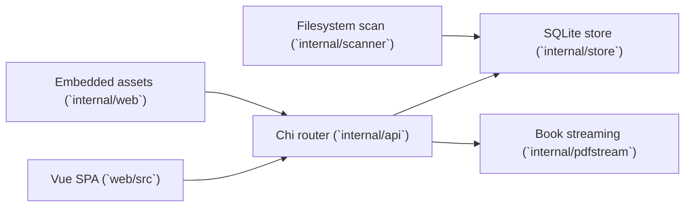

# Architecture

Bookshelf is a single-process application: one Go binary serves the REST API,
streams book files, runs background scans, and hosts the embedded Vue frontend.

The current architecture is intentionally small and server-first. The frontend is
the main client today, but the API and data model should remain usable by future
desktop, mobile, and eInk-oriented clients.

## Runtime overview

## Main components

- `cmd/bookshelf/main.go`
  - reads config
  - opens the database
  - seeds initial settings
  - starts the HTTP server and background scanner
- `internal/api`
  - owns routes, DTOs, validation, and HTTP error handling
- `internal/store`
  - owns SQLite access, embedded migrations, and collection/progress state
- `internal/scanner`
  - walks the library tree, upserts books, and reconciles scan-derived collections
- `internal/pdfstream`
  - serves raw book bytes with HTTP range support
- `web/src`
  - Vue 3 frontend for browsing and reading

## Key domain boundaries

- Books are still identified by relative path today. That is a known limitation and
  is tracked as future foundation work.
- Scan-derived collections mirror the library folder tree and are treated as
  read-only derived structure.
- Manual collections are the editable grouping layer exposed to users.
- The app is single-user and currently has no built-in auth. Deployment should
  assume a private network or external auth boundary.

## Deeper references

- [docs/reference/rest-api.md](docs/reference/rest-api.md)
- [docs/operations/deployment.md](docs/operations/deployment.md)
- [docs/adr/](docs/adr/)
